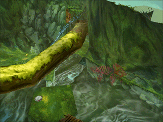

# Rayman 2 Cinematic Mod

Create cinematics within the game Rayman 2 (PC).

  
  

  
  

## Setup

1. Download the mod from the [Releases](https://github.com/coco13579/Rayman2CinematicMod/releases) page
2. Launch Rayman 2
3. Run the mod (R2CinematicMod.exe)

## Controls
- Use <kbd>W</kbd> / <kbd>S</kbd> / <kbd>A</kbd> / <kbd>D</kbd> to move the camera **forward** / **backward** / **left** / **right**
- Use <kbd>PAGE UP</kbd> / <kbd>PAGE DOWN</kbd> to move the camera **upward** / **downward**
- Use <kbd>←</kbd> / <kbd>→</kbd> to rotate the camera to the **left** / **right**
- Use <kbd>↓</kbd> / <kbd>↑</kbd> to pitch the camera **up** / **down**
- Use <kbd>Q</kbd> / <kbd>E</kbd> to roll the camera **anti-clockwise** / **clockwise**
- Press <kbd>P</kbd> to add a **key point**
- Press <kbd>Enter</kbd> to **run the cinematic**

## Credits
Projects that greatly helped me achieve this mod:
- [Rayman2FunBox](https://github.com/rtsonneveld/Rayman2FunBox)
- [OverRay](https://github.com/raytools/OverRay)
